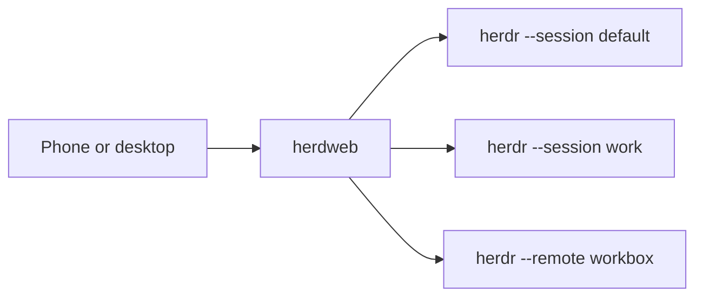

<div align="center">
  
</div>

# herdweb

**Web UI for [herdr](https://herdr.dev/) — drive Herdr servers from your phone.**

One herdweb process attaches to Herdr [servers](https://herdr.dev/docs/concepts/#client-and-server):
the default server on this machine, other named servers on the same machine, and
servers on other machines via [`herdr --remote`](https://herdr.dev/docs/how-to-work/).
It is a self-hosted fork of [connorads/remobi](https://github.com/connorads/remobi) —
independent since 2026-08-20. See the [fork decision](docs/decisions/2026-08-20-fork-herdr-focus.md).

## How it fits together

Herdweb uses Herdr's words, then adds one of its own:

| Word | Meaning |
| --- | --- |
| **Server** | Herdr background process that owns panes. A [named session](https://herdr.dev/docs/concepts/#session) is a separate server namespace on the same machine. |
| **Device** | A machine running Herdr — this laptop, a workbox, anything `herdr --remote` can reach. |
| **Target** | One herdweb spawn command that attaches to one server: `herdr --session …` or `herdr --remote …`. |
| **herdweb** | One process that can hold several targets. The browser attaches to one target at a time. |



The picker is a flat list of targets. Two servers on one device are two rows, not
a device → server submenu. Runtime details live in
[How herdweb works](docs/architecture/how-herdweb-works.md).

## Three shapes

| Shape | Herdr fact | What you run |
| --- | --- | --- |
| **Single device, one server** | One machine, default session | `herdweb serve` — no picker |
| **Single device, several servers** | Named sessions on this machine | `targets` with `herdr --session …` |
| **Several devices** | Herdr servers on other machines | Add `herdr --remote <host>` rows |

Opening the same herdweb URL on a phone and a laptop shares the live target.
That is a client of herdweb, not a Herdr device.

## Why herdweb

- **Built for herdr** — drawer buttons, gestures, and defaults match herdr keybindings
- **One page, many servers** — switch local named sessions and remote machines from a badge
- **Swipe between tabs** — gesture navigation without prefix-key fumbling on a phone
- **Pinch to zoom** — resize text like every other app on your phone
- **Install to your home screen** — standalone PWA
- **Self-hosted** — local-first; publish through Tailscale, Cloudflare, or another layer you trust

## Requirements

- [Node.js](https://nodejs.org/) ≥ 22
- [herdr](https://herdr.dev/docs/install/) — the runtime herdweb attaches to

## Quick start

This is **single device, one server**: default Herdr session on this machine.

```bash
git clone <your-fork-url> herdweb && cd herdweb
pnpm install
git config core.hooksPath .hk-hooks   # enable commit hooks (conventional commits, biome)

# Start (attaches to herdr --session default, serves on 127.0.0.1:7681)
pnpm exec tsx cli.ts serve
```

Or build first, then run from `dist/`:

```bash
pnpm run build:dist
node dist/cli.mjs serve
```

Open `http://localhost:7681` on the same machine to verify. For phone access,
deploy behind a trusted proxy or tunnel — see [Deploying herdweb](docs/deploy-herdr.md).

herdr captures mouse input by default, so touch scroll and tap-to-focus work
with no extra multiplexer configuration.

## Pick your setup

**Single device, several servers** — each named session is its own Herdr server:

```typescript
export default {
  defaultTargetId: 'local',
  targets: [
    { id: 'local', name: 'Local', command: ['herdr', '--session', 'default'], imageDrop: 'local-path' },
    { id: 'dev', name: 'Local · Dev', command: ['herdr', '--session', 'herdweb-dev'], imageDrop: 'local-path' },
  ],
}
```

**Several devices** — add a remote Herdr server as another flat row:

```typescript
export default {
  defaultTargetId: 'local',
  targets: [
    { id: 'local', name: 'Local', command: ['herdr', '--session', 'default'], imageDrop: 'local-path' },
    { id: 'workbox', name: 'Workbox', command: ['herdr', '--remote', 'workbox'], imageDrop: 'disabled' },
  ],
}
```

A picker appears only when there is more than one target. Explicit configs must
set `defaultTargetId` and must not pass a trailing command after `--`. Full
rules: [Configuration — Targets](docs/configuration.md#targets) and
[Deploying herdweb](docs/deploy-herdr.md).

`herdr --remote` is a local thin client over SSH. herdweb can tell that this
local process started or exited; it cannot tell whether a remote pane is healthy.

## Set up with AI

The [herdweb-setup skill](.agents/skills/herdweb-setup/SKILL.md) checks your
environment, interviews you about your workflow, generates a validated
`herdweb.config.ts`, and walks through deployment — one conversation.

Tell your coding agent:

> Read `.agents/skills/herdweb-setup/SKILL.md` in this repo and follow it to onboard me.

## Security model

herdweb is a remote-control surface for your terminal. Anyone who can reach it
can drive the attached Herdr server with your user privileges.

- `herdweb serve` binds to `127.0.0.1` by default.
- The inner PTY-backed session stays local to the herdweb process.
- There is no built-in login, password, or ACL in herdweb itself.
- Safe default: keep it on localhost and publish it through a trusted layer like Tailscale Serve.
- If you use `herdweb serve --host 0.0.0.0`, you are exposing terminal control to
  your LAN / whatever can route to that port. Do that only if you intentionally
  want direct network exposure and have separate network controls in place.

To report a vulnerability, see [SECURITY.md](SECURITY.md).

## Configure

Buttons, gestures, voice, image drop, and push notifications live in
[Configuration](docs/configuration.md). Config search order, `.local` secrets,
and the remobi-migration trap are there too.

Voice capture needs a secure context (HTTPS on a phone; `localhost` is fine).
A plain HTTP LAN address is not — herdweb hides the control rather than showing
a dead mic.

## CLI reference

```text
herdweb serve [--config <path>] [--port <n>] [--host <addr>] [--base-path <path>] [-- <command...>]
  Start herdweb with its built-in web terminal and PWA support.
  Default host: 127.0.0.1. Default port: 7681. Single default command: herdr --session default
  Example: herdweb serve --host 0.0.0.0 --port 8080
  Example: herdweb serve --base-path /random-token
  Example: herdweb serve --port 8080 -- herdr --session dev

herdweb build [--config <path>] [--output <path>] [--dry-run]
  Deprecated. herdweb no longer patches ttyd HTML.

herdweb inject [--config <path>] [--dry-run]
  Deprecated. herdweb no longer patches ttyd HTML.

herdweb init
  Scaffold a herdweb.config.ts with commented defaults.

herdweb --version
herdweb --help
```

Short flags: `-c` (`--config`), `-p` (`--port`). Legacy deprecated flags:
`-o` (`--output`), `-n` (`--dry-run`).

The `--` escape hatch after `serve` overrides the command only in single mode,
for example `herdweb serve -- bash --norc`. Explicit `targets` configs must not
use a trailing command after `--`.

## Docs

| Kind | Where |
| --- | --- |
| Start | This README |
| How-to | [Deploy](docs/deploy-herdr.md) · [Configuration](docs/configuration.md) · [Tailscale Serve](.agents/skills/herdweb-setup/references/tailscale-serve.md) · [Mobile panes](.agents/skills/herdweb-setup/references/mobile-panes.md) · [Keep awake](.agents/skills/herdweb-setup/references/keep-awake.md) |
| Explain | [How herdweb works](docs/architecture/how-herdweb-works.md) · [Networking](docs/architecture/networking-and-websockets.md) · [Herdr concepts](https://herdr.dev/docs/concepts/) |

## Development

```bash
git clone <your-fork-url> herdweb && cd herdweb
pnpm install
git config core.hooksPath .hk-hooks
```

From source (bundles the browser client on the fly via esbuild — no build step):

```bash
pnpm exec tsx cli.ts serve              # localhost:7681, default herdr session
```

### Checks

```bash
pnpm test            # vitest (unit + integration)
pnpm run test:pw     # playwright e2e (needs: pnpm exec playwright install chromium webkit --with-deps)
pnpm run check       # biome lint + format
```

## Release channels

- `main` publishes stable GitHub Releases
- `dev` publishes prereleases
- merge `dev` into `main` to promote an experimental line to stable

This fork does not publish to npm. Versioning and changelog are driven by
semantic-release on push to `main` and `dev`.

## FAQ

**What is a target?**
One spawn command that attaches to one Herdr server. Local named sessions and
`herdr --remote` hosts are all targets. See [Three shapes](#three-shapes).

**Does `herdr --remote` mean the remote pane is healthy?**
No. It only proves the local thin-client process. See
[How to work with Herdr](https://herdr.dev/docs/how-to-work/).

**Can a phone and a laptop share the same server?**
Yes. Open the same herdweb URL. They share that target's live session. Switching
targets in one browser does not switch the other.

**Is this secure?**
herdweb doesn't handle auth — it's a UI overlay. Use a tunnel or VPN you trust.
See [Deploying herdweb](docs/deploy-herdr.md) and
[Tailscale Serve](.agents/skills/herdweb-setup/references/tailscale-serve.md).
Security is your responsibility.

**Why not Termux / Termius / SSH apps?**
They work, but you're managing SSH keys and fighting a UI that wasn't built for
touch. herdweb keeps your herdr workflow and adds touch controls on top.

**Why not chat-based mobile apps?**
Those tools change your workflow. herdweb gives you the raw terminal — full
power, self-hosted, works with every agent herdr can host.

**Is this production-ready?**
It's early. The author uses it daily. Feedback welcome.

**Android shows no install prompt when herdweb is behind Cloudflare Access?**
Chromium's PWA installability check fetches `manifest.json` separately, and the
`<link rel="manifest">` fetch sends no cookies by default. Behind Cloudflare
Access (or any authenticating proxy) that fetch gets redirected to the login
page, the check fails, and no install UI appears. Since v1.6.1 the manifest
link carries `crossorigin="use-credentials"` so the fetch includes cookies —
but only if the proxy lets credentialed requests through. The reliable fix is
to bypass auth for these five paths at the proxy (Cloudflare Access: create a
self-hosted application matching the paths with a Bypass + Everyone policy;
Access matches the most specific path first, so the rest of the site still
requires login): `/manifest.json`, `/sw.js`, `/icon-192.png`, `/icon-512.png`,
`/apple-touch-icon.png`. These paths only expose the app name and icons. If
you serve with `--base-path`, prefix the paths accordingly. iOS "Add to Home
Screen" never validates the manifest or service worker, which is why only
Android is affected.

## Licence

MIT
