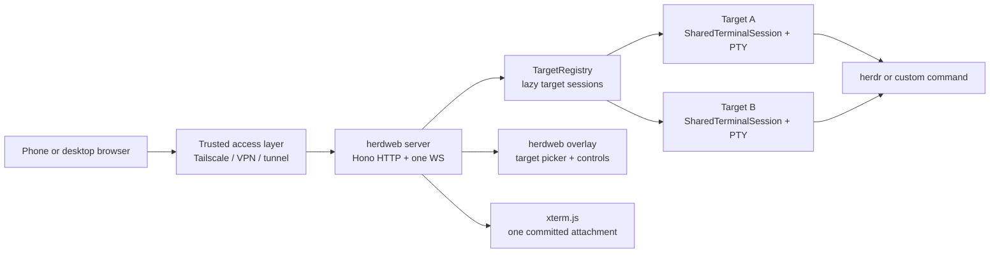
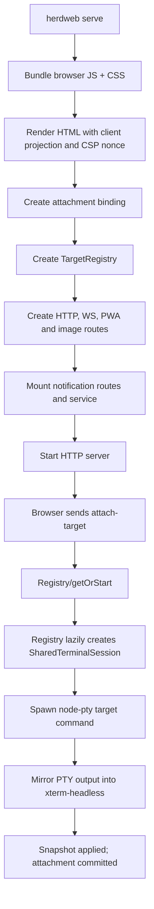

# How herdweb works

herdweb is a phone-sized control surface for herdr. One server owns a target registry; each configured
target lazily gets one local PTY-backed `SharedTerminalSession`. A browser renders only the currently
committed target attachment through `xterm.js`.

For transport and lifecycle details, see [Networking and WebSocket flow](networking-and-websockets.md).

## System view

## Main pieces

| Piece | Role |
| --- | --- |
| Browser client | Opens one `/ws`, lists targets, and controls its committed attachment |
| herdweb overlay | Adds target picker, restore state, controls, reconnect handling, and mobile viewport behaviour |
| Hono server | Serves `/`, `/ws`, PWA assets, image-drop, and notification routes |
| `TargetRegistry` | Keeps configured targets and starts each target session lazily; one target exit does not end the server |
| `SharedTerminalSession` | Owns one PTY, mirrors terminal state, and fans output to attachment clients |
| `node-pty` | Spawns the target command on the herdweb host |

Commands and credentials remain server-side. The browser receives target names, process state, and an
allowlisted capability summary, not target argv.

## Runtime boot path

`herdweb serve` bundles the browser client, renders HTML, creates the attachment binding and target
registry, mounts HTTP/WS/notify routes, then listens. No target PTY is required at boot: the default or
selected target is started lazily when its attachment begins.

## Shared vs per-browser state

- A configured target owns one session and can be reused by multiple browsers.
- Each browser has one WebSocket and at most one committed attachment; switching invalidates the old one.
- A new attachment receives a snapshot, drains pending output into xterm, then commits before input opens.
- Target picker choice, drafts, reconnect UI, and viewport state remain local to the browser.

## Where the code lives

| Area | Notes |
| --- | --- |
| `src/serve.ts` | HTTP/WS routes, registry wiring, attachment routing, headers, and shutdown |
| `src/target-registry.ts` | Lazy target lifecycle and per-target status |
| `src/session.ts` | PTY lifecycle, state mirroring, snapshots, and fan-out |
| `src/session-protocol.ts` | Protocol 2 messages, target summaries, and bounds checks |
| `src/ws-attachment-binding.ts` | Provisional/committed attachment capabilities and input gate |
| `src/client-entry.ts` | One-socket client, target restore/switch, snapshot/commit state machine |

The headless mirror is the server source of terminal screen truth. It lets a new attachment rebuild the
visible screen without asking herdr to replay history, while the target registry keeps other targets lazy.
