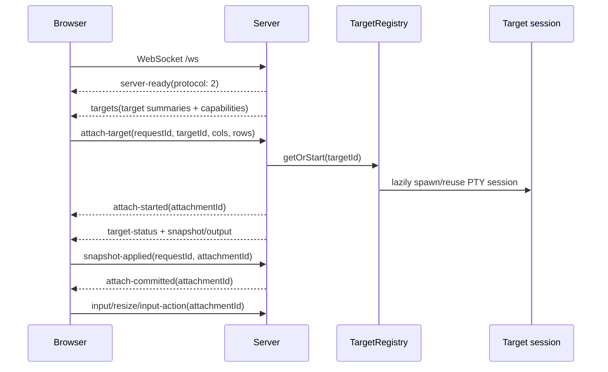

# Networking and WebSocket flow

herdweb uses one same-origin WebSocket per browser. Protocol 2 routes terminal traffic with an
`attachmentId`; target selection is a server-side attachment lifecycle, not a second browser connection.

## Network boundary

- `herdweb serve` binds to `127.0.0.1` by default; there is no built-in login or ACL.
- Put the localhost server behind Tailscale Serve, a VPN, or another trusted access layer.
- `GET /` serves the client; `GET /ws` is the terminal control plane; `POST /api/image-drop` accepts raw image bytes.
- `POST /api/events` and push routes apply their loopback, origin, and configured token checks.
- `--base-path /prefix` adds the same routes under `/prefix/...`.

## Protocol 2 attach flow

The server sends `targets` on connection and `target-status` as an individual target changes. A target
summary contains `id`, display name, process state/exit information, and `capabilities.imageDrop`.

### Browser to server

| Type | Routing and purpose |
| --- | --- |
| `attach-target` | Starts or reuses a target attachment; carries request id and geometry |
| `snapshot-applied` | Confirms that the matching attachment snapshot and all queued xterm writes are applied |
| `input`, `resize`, `input-action` | Carry the committed `attachmentId`; stale or uncommitted ids are rejected |
| `restart-target` | Requests restart only for a target in `process-exited` state |
| `ping` | Liveness probe |

### Server to browser

| Type | Routing and purpose |
| --- | --- |
| `targets` | Initial target list and per-target image capability |
| `target-status` | Process state change for one target |
| `attach-started` | Provisional request/target/attachment identity |
| `snapshot`, `output`, `exit`, `error` | Terminal frames carrying `attachmentId` |
| `attach-committed` | The only point at which the matching attachment accepts input |
| `attach-rejected`, `snapshot-failed`, `target-restarted`, `pong` | Lifecycle result or liveness response |

## Attachment safety

Starting a new attach closes the input gate and invalidates the prior committed attachment for that
browser. The new attachment remains provisional while geometry is applied, the snapshot is rendered, and
all buffered output writes drain. `snapshot-applied` must match both request and `attachmentId`; only then
does `attach-committed` open input and allow explicit-mode target persistence. An unknown, stale, or
uncommitted id is not routed to any PTY.

Terminal protocol limits are enforced in `src/session-protocol.ts`: client messages and individual input
messages are at most 256 KiB; resize is bounded to 500 columns by 200 rows. These wire shapes are internal
implementation contracts.

## Image-drop capability and guards

`POST {basePath}/api/image-drop` must carry the dedicated
`x-herdweb-attachment-id` header. The server resolves that header to the browser's current committed
attachment and checks that target's `imageDrop` capability is `local-path`; `disabled` targets fail.

The request has three guards:

1. **Pre-body:** origin and committed attachment/capability are checked before reading bytes.
2. **Post-body:** the same binding is checked after the bounded raw body is read, before format handling.
3. **Post-write:** the binding is checked after writing a fresh `0600` temp file; a stale result removes
   only that request's file and does not return a path.

Bodies are magic-byte sniffed (PNG/JPEG/WebP/GIF; HEIC is explicitly rejected), capped at 10 MiB, and
returned with `Cache-Control: no-store`. The browser inserts the returned path only for the still-current
attachment and never sends Enter as part of the upload.

## Client reconnect and target restore

The client reconnects the same `/ws`, receives a fresh target list, and repeats the attach handshake. In
explicit mode, a URL/local-storage target is durable only after `attach-committed`; missing or invalid
ids show a restore-blocked state instead of silently attaching another target. Single mode has no picker
or durable target choice and attaches its default target.
